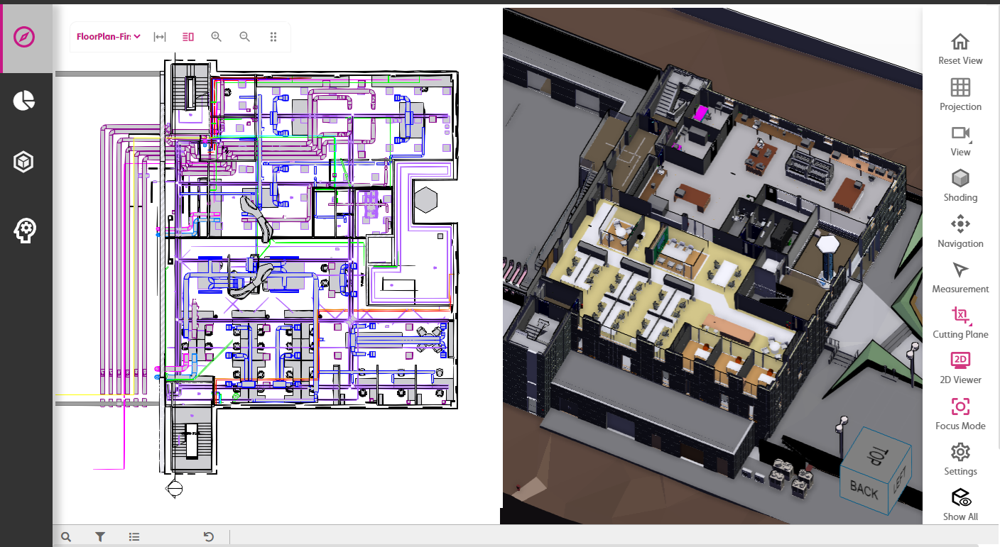
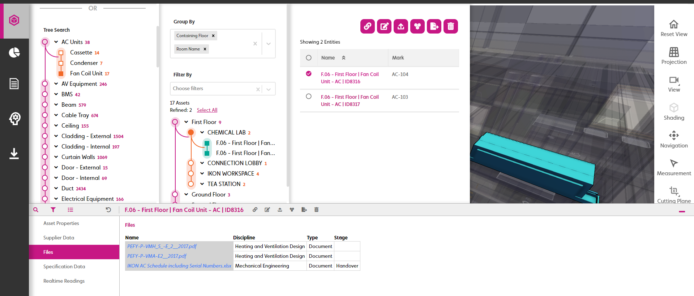

# digitaltwin-factory

[digitaltwin-factory](https://community.digitaltwin-factory.com/) is an open-source community powering development of digital twins on Twinit. Join the digitaltwin-factory community to gain access to a wealth of information and training material on how to use Twinit to accomplish your digital twin goals. Membership in digitaltwin-factory open-source community includes access to self-led development courses for building applications using Twinit, access to the developer documentation for Twinit concepts, services, and APIs, access to open-source code modules and UI libraries to help accelerate and kick-start your projects, as well as access to a community of developers who develop using Twinit. For more information visit [https://invicara.com/](https://invicara.com/) and [https://twinit.com/](https://twinit.com/.)

# Digital Buildings (ipa-core-bt)

This repository contains open-source code, pageComponents, scripts, configurations, utilities, and more for use with Twinit to create an Asset Twin of a digital building using an ipa-core based application, all available under the Apache 2.0 License.

> To use any of the content of Digital Building (ipa-core-bt) contents, you need to have first completed all of the Self-Led Developer training courses in Twinit Academy including the React framework ipa-core courses.

Be sure to read the readme for each module for instructions on how to use it.

# Where to Start

The best place to start is by using the [Asset Twin Setup](Asset%20Twin%20Setup/README.md) to re-create an example Asset Twin project.