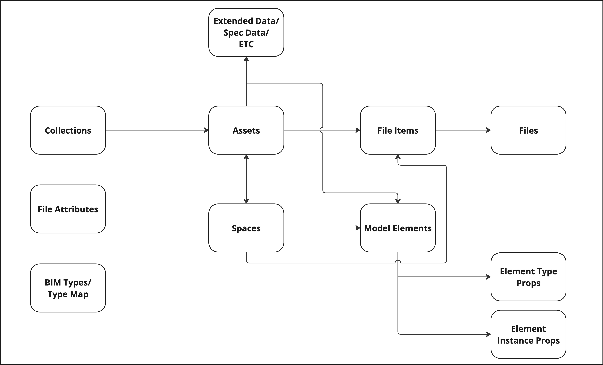

# Data Model

## Data types
Each link below will give more detail as to what that data type is, how it is structured etc.

[Spaces](./data_types/spaces.md)
[Assets](./data_types/assets.md)
[Extended Data](./data_types/extended_data.md)
[Collections](./data_types/collections.md)
[Files](./data_types/files.md)
[File Items](./data_types/file_items.md)
[File Attributes](./data_types/file_attributes.md)
[BIM Types](./data_types/bim_types.md)

<!---  Are these needed below? 
[Model Elements](./data_types/properties.md)
[Element Type Props](./data_types/properties.md)
[Element Instance Props](./data_types/properties.md)
-->

## JSON data for Asset Twin objects
[Entities](./data_types/entities.md)
[Properties](./data_types/properties.md)

## Model import orchestrator
In order to learn more about the Model Import process, please review section '06- Datasources Service Overview and Model Import' of the 'How to Build an App on Twinit (Advanced) v2.0' course on [academy.twinit.io](https://academy.twinit.io/) where you can find a detailed explanation of how datascources and the Model Import process operates.

>One of the steps of the Orchestrator scripts is to migrate relations to the model. This script checks to see if there is a previous version of the model present and if that pervious version has any relations from model elements to DT spaces or DT assets. If so, it attempts to recreate the same relations on the new version of the model.

<!---  Note that the above has the extra step that will migrate relations to the model (explain this). We don't need to explain how the script works, just that this logic to do that is in this script and is used by this orchestrator -->