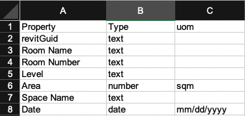

# Undersanding Properties

>There are no predefined properties for data types. It is up to the developer to add in whichever properties make sense for their version of that data type.

The below table will display the different property keys we can assign to a property object.
<table>
  <tbody>
    <tr>
      <th>Property keys</th>
      <th>Description</th>
    </tr>
    <tr>
      <td>val</td>
      <td align="left">Value of the property</td>
    </tr>
    <tr>
      <td>dname</td>
      <td align="left">Display name to use as an alternative to the property name</td>
    </tr>
    <tr>
      <td>type</td>
      <td align="left">
       Property type
      </td>
    </tr>
     <tr>
      <td>srcPropName</td>
      <td align="left">Name of the original property if from Revit</td>
    </tr>
     <tr>
      <td>epoch</td>
      <td align="left">Unix epoch timestamp if type date</td>
    </tr>
     <tr>
      <td>uom</td>
      <td align="left">Unit of measure for the property</td>
    </tr>
  </tbody>
</table>

Here is an example of a `Room Number` object that you might find in a `properties` array:

```json
"Room Number": {
            "val": "F.13",
            "srcPropName": "Room Number",
            "dName": "Room Number",
            "type": "text"
        },
```

## Property types
Each property can have any one of the below property types:
* text
* number
* date
* datetime
* tags
* boolean

Please refer to the [Digital_Buildings_Workflow_Document.pdf](../../example_asset_twin/Digital_Buildings_Workflow_Document.pdf) example to learn about how to add property types to a property using the `config_sheet.xlsx`.

>When assigning the `date` or `datetime` property types, we must add a unit to the `uom` (Unit of Measurement) column. For `date`, you must add a date format such as `mm/dd/yyyy`. 

