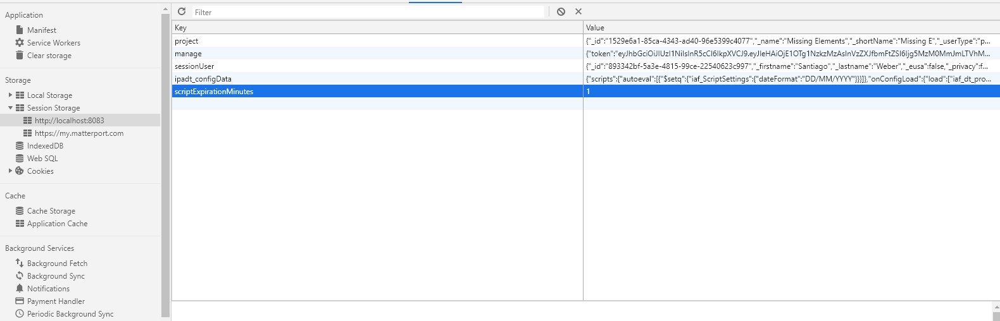

## Script Cache Expiration

Script execution results will be saved in the cache, for a default duration (currently 10 minutes). In order to override this default duration, you can open the developer tools → Application. In there you will find the session storage. To change the duration, add a key to the storage, called 'scriptExpirationMinutes', and give it the value you wish to set as the new duration.

